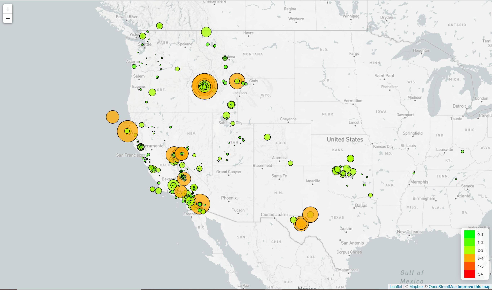
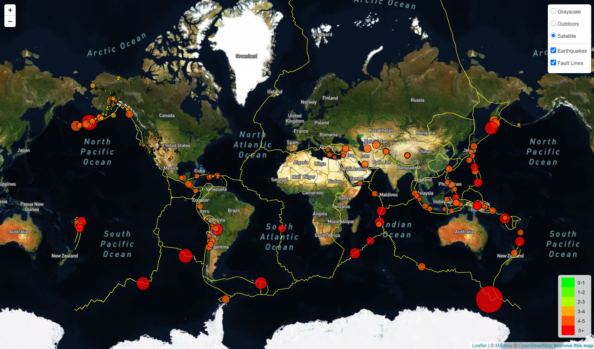

# leaflet-challenge - Mapping Homework

## Level 1 - Basic Visualization

* Imported dataset (All earthquakes over 1.0 magnitude in the last week)
* Mapped earthquake intances
* Uses data markers that reflect the earthquake magnitude using marker size and color
* Created legend

## Level 2 - More Data (Optional)

* Imported faultline data
* Added fault lines to the map
* Added controls to turn overlays (earthquakes, fault lines) on/off
* Add tile layers for outdoor and satellite view maps